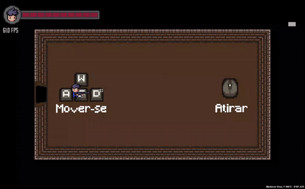

# Mystery Rooms

A game made in Python in which your objective is to clear rooms by exterminating monsters.

## Demo



## Functionalities

- Generation of procedural rooms
- Minimap system
- Shooting system
- Gun that follows your mouse
- And more

## Installation

Download the project folder and install pygame with the command:
```bash
pip install pygame
```
